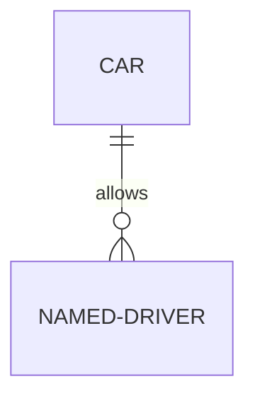

# Development

- [X] Set up issue tracking (Linear or GitHub) @Luciano
- [ ] Set up the team @Luciano
- [ ] CI/CD with GitHub and possibly GitHub or a customized system (@bhargav)
- [ ] Update README with initial setup (add a high-level component diagram) @Tracy)
- [ ] Finish User Management (@Luciano)
- [ ] Finish Project Management (including db)
- [ ] Scripts to ingest test datasets (@Fatemeh)
- [ ] Basic visual analytics (view raw data) (@Tracy)
- [ ] Architecture analytics (modular, depends on the data) (@Luciano)
- [ ] End-user documentation (@Yuvika)

Do a diagram for deployment (we want Postgres DB, W4H app, W4H api)

