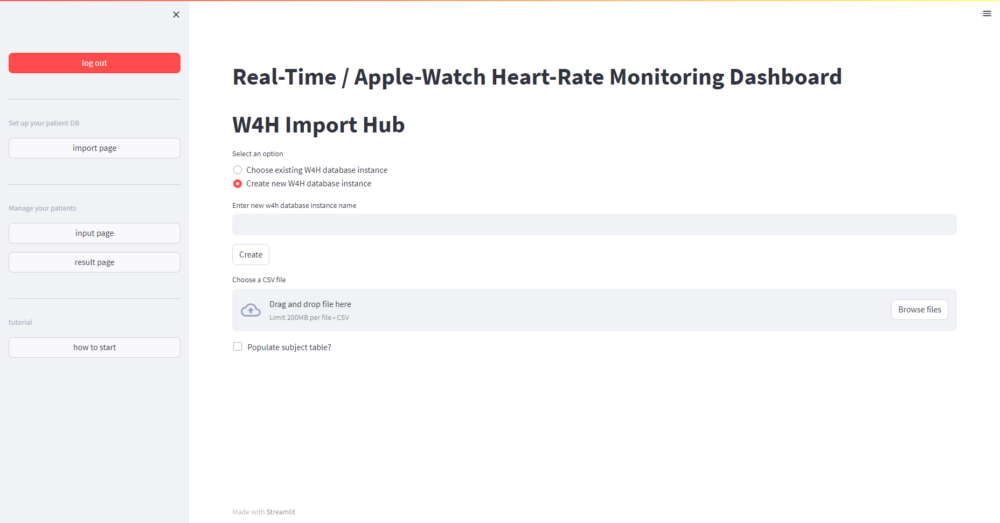
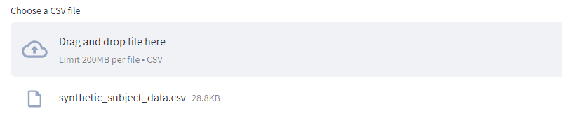
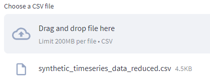
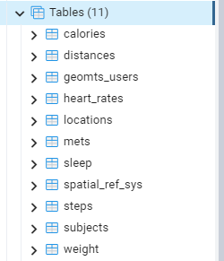
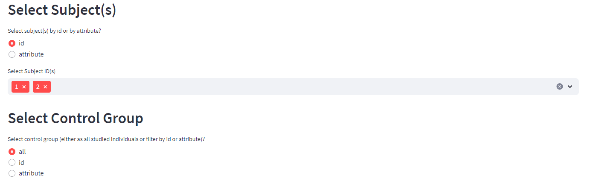

# Use W4h dashboard to track your patients' health data

## Introduction

The W4H GeoMTS dashboard is designed to provide visualization and analysis capabilities for GeoMTS data catered specifically for Apple Watch demo purposes.

## How to play with it

0. **Log in**  
    We have provided a default account for you to test the system. In the future, w4h will be polished to support multiple users and password management.
    The default account is:
    > username: admin  
      password: admin

1. **Create/Manage your database instance in your DB server:**  
At this moment, you should have read the Setting up tutorial and set up your database server.
If you already have data in proper format in your database, you can skip this step.  
Click the "import page" button on the left side of the dashboard, you will see a page like this:  
    

    Let's start from creating a new database instance:  
    First, Select "Create new W4H database instance"    
    

    
    Second, type in the name of database you want to make, and click "create". In this case we name it "test2"
    
    If it's created successfully, you will see a message like this:   
    
    
    Third, select "Choose existing W4H database instance"  
    
    Select the database you just created  
    

    For the Following step, if you need some test file, try to download here:  
    [synthetic_subject_data.csv](./../../images/synthetic_subject_data.csv)

    [synthetic_timeseries_data_reduced.csv](./../../images/synthetic_timeseries_data_reduced.csv)

    Fourth, Upload your subjects csv file, and check "Populate subject table name". 
    
    After making sure corresponding Column are all correct, click "Populate database" at the bottom.  
    

    Fifth, upload your time series csv file   
    
    After making sure corresponding Column are all correct, click "Populate database" at the bottom.  
    
    
    (Optional)Sixth, open your DB management tool, such as PgAdmin4, and check if the data is populated correctly.  
    

2. **choose your db in the input page, then setup it!**  
    
    choose your db in the input page   
      

    select the subjects and control group you want to check   
      

    select if you want to simulate the data
    click "show result"
3. **check the result page**  
    You are there!  
     

