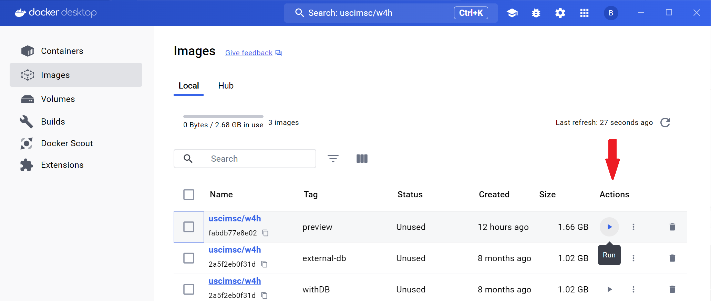

# Quick Start

The W4H Toolkit provides an ecosystem of tools to manage and analyze wearable and other EHR data. We have created a Docker container to give you an overview of what's included in the toolkit.

## Starting the Container

You will need to install the `Docker Engine` by following the instructions to [Install Docker Engine](https://docs.docker.com/engine/install/) for your platform.

Once that is done start and type `uscimsc/w4h` in the search bar and select  the `preview` tagged image. After pulling to download the image, run the container by clicking on the “run” icon under “Actions” next to the image name.

## Using the Dashboard

## Using the Sample Notebookes

## Next Steps

